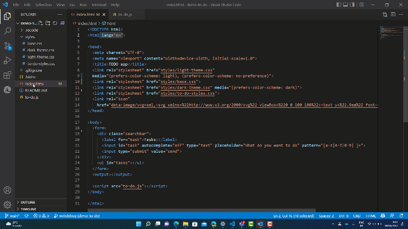

# Microsoft Edge Developer Tools for Visual Studio Code

This extension allows you to use the Developer Tools of Microsoft Edge inside Visual Studio Code. 

Features:

* Live analysis of issues in your source code - find out about problems while you develop
* Browser preview with built in toolbar for device and mode emulation
* Changes in the Styles tool sync live with your source code - including abstractions like Sass and React using Sourcemaps
* Console and Application tool
* Breakpoint support

**Note**: This extension needs Microsoft Edge to be on your computer. Windows machines already come with it, for Mac and Linux, please [download and install a version of Edge](https://www.microsoft.com/edge).

## Documentation

For more details on how to use and customize the extension, [refer to the documentation](https://learn.microsoft.com/microsoft-edge/visual-studio-code/microsoft-edge-devtools-extension).

## Contributing

This project welcomes contributions and suggestions.  Most contributions require you to agree to a
Contributor License Agreement (CLA) declaring that you have the right to, and actually do, grant us
the rights to use your contribution. For details, visit [https://cla.microsoft.com](https://cla.microsoft.com).

See [CONTRIBUTING.md](https://github.com/Microsoft/vscode-edge-devtools/blob/main/CONTRIBUTING.md) for more information.

## Other information

### Data and Telemetry

The extension gets data and telemetry from Visual Studio code we use to improve the product. If you don't want to allow this, you can find the instructions how to turn off telemetry [in the Visual Studio Code documentation](https://code.visualstudio.com/docs/getstarted/telemetry)

**Data Collection**. The software may collect information about you and your use of the software and send it to Microsoft. Microsoft may use this information to provide services and improve our products and services. You may turn off the telemetry as described in the repository. There are also some features in the software that may enable you and Microsoft to collect data from users of your applications. If you use these features, you must comply with applicable law, including providing appropriate notices to users of your applications together with a copy of Microsoft’s privacy statement. Our privacy statement is located at [https://go.microsoft.com/fwlink/?LinkID=824704](https://go.microsoft.com/fwlink/?LinkID=824704). You can learn more about data collection and use in the help documentation and our privacy statement. Your use of the software operates as your consent to these practices.

### Reporting Security Issues

Security issues and bugs should be reported privately, via email, to the Microsoft Security
Response Center (MSRC) at [secure@microsoft.com](mailto:secure@microsoft.com). You should
receive a response within 24 hours. If for some reason you do not, please follow up via
email to ensure we received your original message. Further information, including the
[MSRC PGP](https://technet.microsoft.com/security/dn606155) key, can be found in
the [Security TechCenter](https://technet.microsoft.com/security/default).
