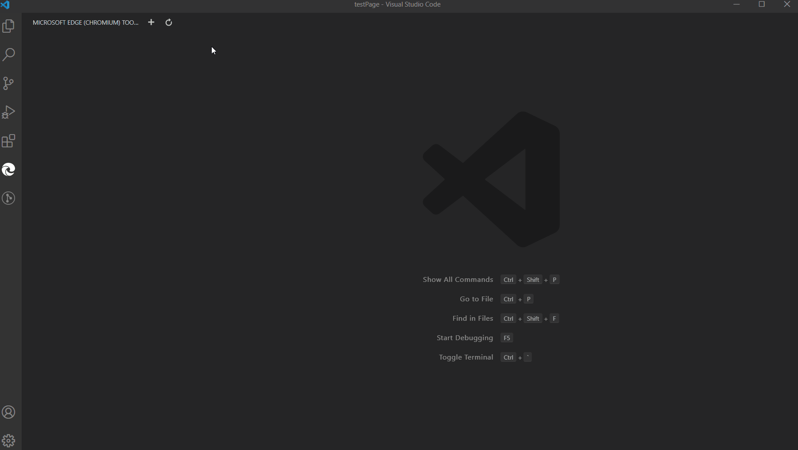
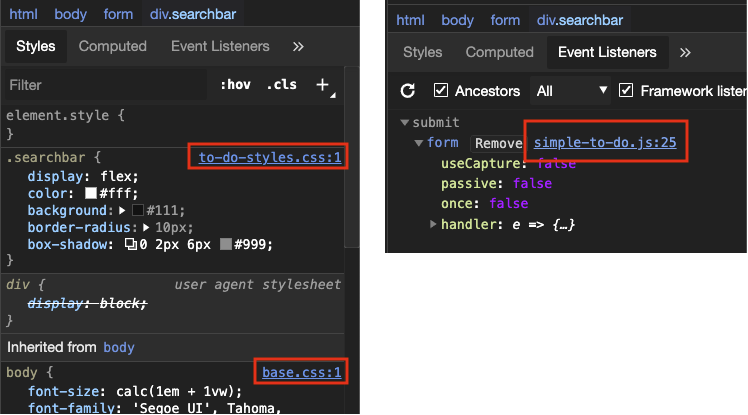
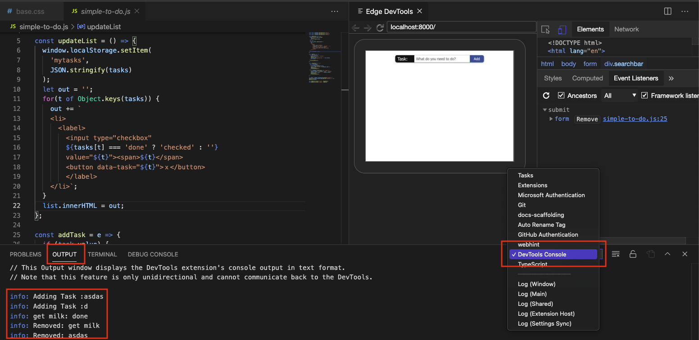
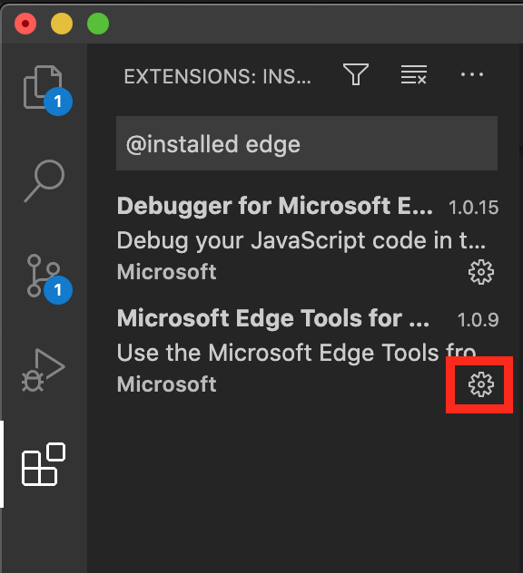
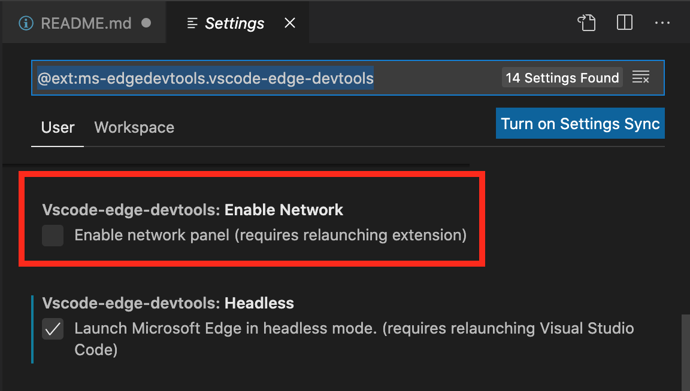
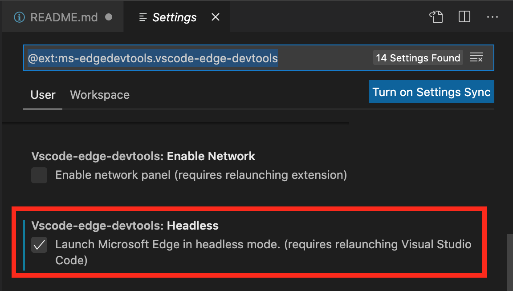

# Microsoft Edge Developer Tools for Visual Studio Code

**Show the browser's Elements and Network tool inside the Visual Studio Code editor and use it to fix CSS issues with your site and inspect network activity.**

A Visual Studio Code extension that allows you to use the browser's Elements and Network tool from within the editor. The DevTools will connect to an instance of Microsoft Edge giving you the ability to see the runtime HTML structure, alter layout, fix styling issues, read console messages and view network requests. All without leaving Visual Studio Code.

**Note**: This extension _only_ supports Microsoft Edge (version greater than 80.0.361.48)

You can use the extension either in an own window or embedded in your editor.


## Table of Contents

* [Supported Features](#supported-features)
* [Getting Started](#getting-started)
* [Using the tools](#using-the-tools)
  * [Launching the browser via the side bar view](#launching-the-browser-via-the-side-bar-view)
  * [Opening source files from the Elements tool](#opening-source-files-from-the-elements-tool)
  * [Getting Console information](#getting-console-information)
  * [Setting up your project to show live changes in the extension](#setting-up-your-project-to-show-live-changes-in-the-extension)
* [Changing Extension Settings](#changing-extension-settings)
  * [Turning on Network Inspection](#turning-on-network-inspection)
  * [Turning on Headless Mode](#turning-on-headless-mode)
* [Debug Configuration](#debug-configuration)
  * [Other optional launch config fields](#other-optional-launch-config-fields)
  * [Attaching automatically when launching the browser for debugging](#attaching-automatically-when-launching-the-browser-for-debugging)
* [Contributing](#contributing)
* [Other information](#other-information)
* [Data and Telemetry](#data-and-telemetry)
* [Reporting Security Issues](#reporting-security-issues)


## Supported Features

* Fully featured Elements and Network tool with views for HTML, CSS, accessibility and more.
* Screen-casting feature to allow you to see your page without leaving Visual Studio Code.
* Debug configurations for launching Microsoft Edge browser in remote-debugging mode and auto attaching the tools.
* Debug using a windowed or headless version of the Microsoft Edge Browser
* Side Bar view for listing all the debuggable targets, including tabs, extensions, service workers, etc.
* Go directly to the line/column for source files in your workspace when clicking on a link or CSS rule inside the Elements tool.
* Read console messages logged by the Developer Tools
* Auto attach the Microsoft Edge Tools when you start debugging with the in-built debugger.

## Getting Started

For use inside Visual Studio Code:

1. Install any channel (Canary/Dev/etc.) of [Microsoft Edge](https://aka.ms/edgeinsider).
1. Install the extension* [Microsoft Edge Tools](https://marketplace.visualstudio.com/items?itemName=ms-edgedevtools.vscode-edge-devtools).
1. Navigate to any project or open the folder containing the project you want to work on.

## Using the tools

### Launching the browser via the side bar view

* Start Microsoft Edge via the side bar
  * Click the `Microsoft Edge Tools` view in the side bar.
  * Click the `Open a new tab` icon to launch the browser (if it isn't open yet) and open a new tab.
* Attach the Microsoft Edge Tools via the side bar view
  * Click the `Attach` icon next to the tab to open the Microsoft Edge Tools.

The extension operates in two modes - it can launch an instance of Microsoft Edge navigated to your app, or it can attach to a running instance of Microsoft Edge. Both modes requires you to be serving your web application from local web server, which is started from either a Visual Studio Code task or from your command-line. Using the `url` parameter you tell Visual Studio Code which URL to either open or launch in the browser.

You can now use the high-fidelity tools to tweak your CSS and inspect network calls and go directly back to your code without leaving the editor.



### Opening source files from the Elements tool

One of the features of the Elements tool is that it can show you what file applied the styles and event handlers for a given node.

The source files for these applied styles and attached event handlers appear in the form of links to a url specified by the browser. Clicking on one will attempt to open that file inside the Visual Studio Code editor window.



### Getting Console information

The extension automatically forwards messages from the [Developer Tools Console](https://docs.microsoft.com/en-us/microsoft-edge/devtools-guide-chromium/console/) to Visual Studio Code. You can see them in the `output` tab when you selected `Devtools Console` as the source.



Notice that this is a read-only experience. You can't use the Console like you would in the browser Developer Tools.

### Setting up your project to show live changes in the extension

Out of the box the extension does not track live changes to the code you write. If you want the browser to automatically refresh when you changed a file, you need to set up a live reload environment. For this you need Node.js and npm on your machine. 

Say you have a folder with your production files on your hard drive called `my-project`. 

Preparation step: Install Node.js and the reload package

* Download and install [Node.js](https://www.nodejs.org) (you only need to do this once).
* Install the [reload NPM package](https://www.npmjs.com/package/reload?activeTab=readme)
  * Open command prompt and run `npm install reload -g` to install the package globally

Attach the extension to your live reloading project

* Navigate to your `my-project` folder in your command prompt and run `reload`
* Open VS Code and open the directory
* Go to the extension and launch an instance
* Navigate in the browser of the extension to `localhost:8080/{file name you want to open}`	
* All changes that are saved in this folder now trigger a refresh

## Changing Extension Settings

You can customize the extension to your needs. You can reach the settings by clicking the gear icon of the extension listing or via the settings menu.



### Turning on Network Inspection

You can enable the Network Pane to inspect any network request of the attached browser. To do this, change the setting and restart the extension.



You can see an example of the change in the following screencast. After restart, you get an extra tab with network functionality.

.gif)

### Turning on Headless Mode

By default, the extension will launch the browser in its own window. This means you get an extra browser icon in your task bar and you need to turn on casting to see the browser inside the editor. You can also choose "headless mode" to not have the browser open in an own window, but embed itself directly into Visual Studio Code.

**Note**: In the past we had issues on Macintosh computers where the Microsoft Edge instance reported itself as "inactive" when the window wasn't visible. Using headless mode fixes that problem.



You can see an example of the change in the following screencast:

.gif)

## Debug Configuration

You can launch the Microsoft Edge Tools extension like you would a debugger, by using a `launch.json` config file. 

Microsoft Edge Tools works automatically bundled the Microsoft Edge debugger for you, which means that you can use the tools to design your frontend and debug your code using breakpoints.

To add a new debug configuration, in your `launch.json` add a new debug config with the following parameters:

* `type` - The name of the debugger which must be `vscode-edge-devtools.debug.` **Required.**
* `request` - `launch` to open a new browser tab or `attach` to connect to an existing tab. **Required.**
* `name` - A friendly name to show in the Visual Studio Code UI. **Required.**
* `url` - The url for the new tab or of the existing tab. **Optional.**
* `file` - The local file path for the new tab or of the existing tab. **Optional.**
* `webRoot` - The directory that files are served from. Used to resolve urls like `http://localhost:8000/app.js` to a file on disk like `/out/app.js`. **Optional.**

```javascript
{
    "version": "0.1.0",
    "configurations": [
        {
            "type": "vscode-edge-devtools.debug",
            "request": "launch",
            "name": "Launch Microsoft Edge and open the Edge DevTools",
            "file": "${workspaceFolder}/index.html"
        },
        {
            "type": "vscode-edge-devtools.debug",
            "request": "attach",
            "name": "Attach to Microsoft Edge and open the Edge DevTools",
            "url": "http://localhost:8000/",
            "webRoot": "${workspaceFolder}/out"
        }
    ]
}
```

#### Other optional launch config fields

* `browserPath`: The full path to the browser executable that will be launched. If not specified the most stable channel of Microsoft Edge will be launched from the default install location instead.
* `hostname`: By default the extension searches for debuggable instances using `localhost`. If you are hosting your web app on a remote machine you can specify the hostname using this setting.
* `port`: By default the extension will set the remote-debugging-port to `9222`. Use this option to specify a different port on which to connect.
* `userDataDir`: Normally, if Microsoft Edge is already running when you start debugging with a launch config, then the new instance won't start in remote debugging mode. So by default, the extension launches Microsoft Edge with a separate user profile in a temp folder. Use this option to set a different path to use, or set to false to launch with your default user profile instead.
* `useHttps`: By default the extension will search for attachable instances using the `http` protocol. Set this to true if you are hosting your web app over `https` instead.
* `sourceMaps`: By default, the extension will use sourcemaps and your original sources whenever possible. You can disable this by setting `sourceMaps` to false.
* `pathMapping`: This property takes a mapping of URL paths to local paths, to give you more flexibility in how URLs are resolved to local files. `"webRoot": "${workspaceFolder}"` is just shorthand for a pathMapping like `{ "/": "${workspaceFolder}" }`.
* `sourceMapPathOverrides`: A mapping of source paths from the sourcemap, to the locations of these sources on disk. 
* `urlFilter`: A string that can contain wildcards that will be used for finding a browser target, for example, "localhost:*/app" will match either "http://localhost:123/app" or "http://localhost:456/app", but not "https://stackoverflow.com". This property will only be used if `url` and `file` are not specified.
* `timeout`: The number of milliseconds that the Microsoft Edge Tools will keep trying to attach to the browser before timing out. Defaults to 10000ms.

### Attaching automatically when launching the browser for debugging

* Setup your `launch.json` configuration to launch and debug Microsoft Edge.
  * See [Debugger for Microsoft Edge Readme.md](https://github.com/microsoft/vscode-edge-debug2/blob/master/README.md).
* Start Microsoft Edge for debugging.
  * Once debugging has started, the Microsoft Edge Tools will auto attach to the browser (it will keep retrying until the Debugger for Microsoft Edge launch.json config `timeout` value is reached).
  * This auto attach functionality can be disabled via the `vscode-edge-devtools.autoAttachViaDebuggerForEdge` Visual Studio Code setting.

## Contributing

This project welcomes contributions and suggestions.  Most contributions require you to agree to a
Contributor License Agreement (CLA) declaring that you have the right to, and actually do, grant us
the rights to use your contribution. For details, visit https://cla.microsoft.com.

See [CONTRIBUTING.md](https://github.com/Microsoft/vscode-edge-devtools/blob/master/CONTRIBUTING.md) for more information.

## Other information

### Data and Telemetry

This project collects usage data and sends it to Microsoft to help improve our products and services. Read [Microsoft's privacy statement](https://privacy.microsoft.com/en-US/privacystatement) to learn more.

### Reporting Security Issues

Security issues and bugs should be reported privately, via email, to the Microsoft Security
Response Center (MSRC) at [secure@microsoft.com](mailto:secure@microsoft.com). You should
receive a response within 24 hours. If for some reason you do not, please follow up via
email to ensure we received your original message. Further information, including the
[MSRC PGP](https://technet.microsoft.com/en-us/security/dn606155) key, can be found in
the [Security TechCenter](https://technet.microsoft.com/en-us/security/default).
