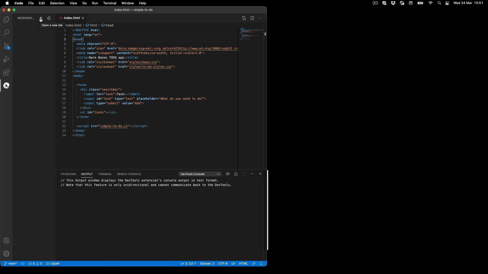
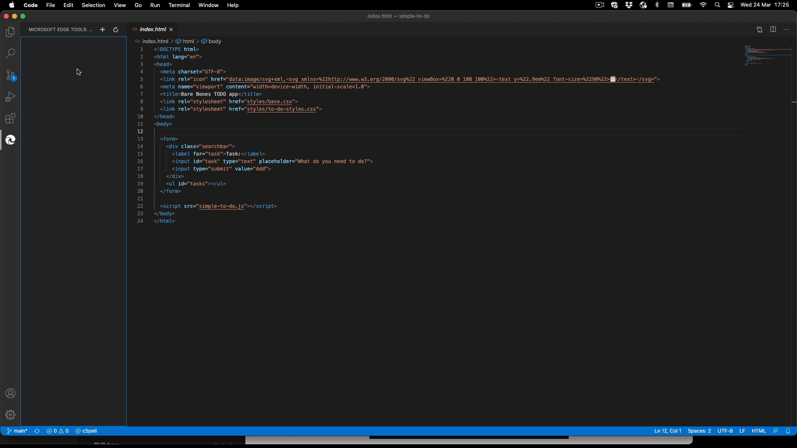

# Microsoft Edge Developer Tools for Visual Studio Code

**Show the browser's Elements and Network tool inside the Visual Studio Code editor and use it to fix CSS issues with your site and inspect network activity.**

A Visual Studio Code extension that allows you to use the browser's Elements and Network tool from within the editor. The DevTools will connect to an instance of Microsoft Edge giving you the ability to see the runtime HTML structure, alter layout, fix styling issues, read console messages and view network requests. All without leaving Visual Studio Code.

**Note**: This extension _only_ supports Microsoft Edge (version greater than 80.0.361.48)

You can use the extension either in an own window or embedded in your editor.

## Documentation 

For more details on how to use and customize the extension, [refer to the documentation](https://microsoft.github.io/vscode-edge-devtools/index). 

## Contributing

This project welcomes contributions and suggestions.  Most contributions require you to agree to a
Contributor License Agreement (CLA) declaring that you have the right to, and actually do, grant us
the rights to use your contribution. For details, visit https://cla.microsoft.com.

See [CONTRIBUTING.md](https://github.com/Microsoft/vscode-edge-devtools/blob/master/CONTRIBUTING.md) for more information.

## Other information

### Data and Telemetry

This project collects usage data and sends it to Microsoft to help improve our products and services. Read [Microsoft's privacy statement](https://privacy.microsoft.com/en-US/privacystatement) to learn more.

### Reporting Security Issues

Security issues and bugs should be reported privately, via email, to the Microsoft Security
Response Center (MSRC) at [secure@microsoft.com](mailto:secure@microsoft.com). You should
receive a response within 24 hours. If for some reason you do not, please follow up via
email to ensure we received your original message. Further information, including the
[MSRC PGP](https://technet.microsoft.com/en-us/security/dn606155) key, can be found in
the [Security TechCenter](https://technet.microsoft.com/en-us/security/default).
