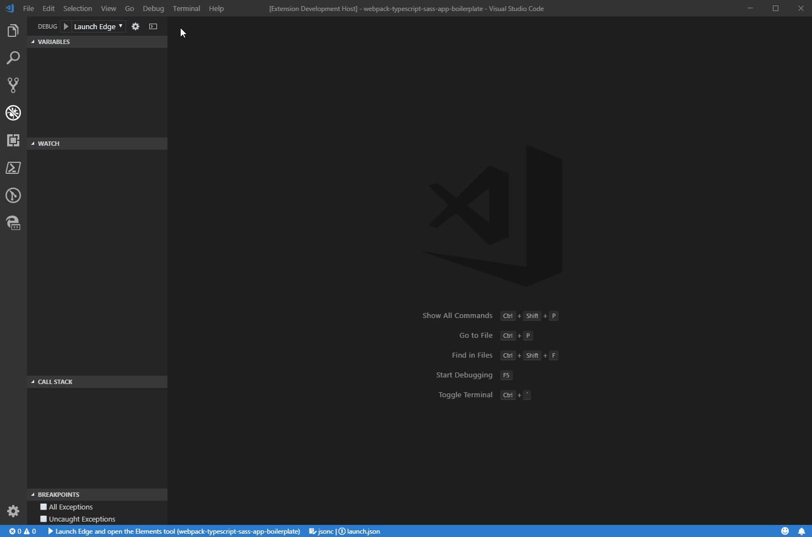
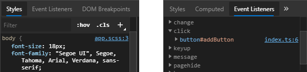

<h1 align="center">
  <br>
  VS Code - Microsoft Edge (Chromium) Tools
  <br>
</h1>

<h4 align="center">Show the browser's Elements and Network tool inside the VSCode editor and use it to fix styling, layout, and CSS issues with your site.</h4>

A VS Code extension that allows you to use the browser's Elements and Network tool from within the editor. The DevTools will connect to an instance of Microsoft Edge giving you the ability to see the runtime HTML structure, alter layout, fix styling issues, and view network requests. All without leaving VS Code.

**Note**: This extension only supports Microsoft Edge (Chromium)



**Supported Features**
* Debug configurations for launching Microsoft Edge browser in remote-debugging mode and auto attaching the tools,
* Side Bar view for listing all the debuggable targets, including tabs, extensions, service workers, etc.
* Fully featured Elements and Network tool with views for HTML, CSS, accessibility and more.
* Screen-casting feature to allow you to see your page without leaving VSCode.
* Go directly to the line/column for source files in your workspace when clicking on a link or CSS rule inside the Elements tool.
* Auto attach the Microsoft Edge Tools when you start debugging with the [Debugger for Microsoft Edge](https://marketplace.visualstudio.com/items?itemName=msjsdiag.debugger-for-edge) extension.

# Using the Extension
## Getting Started
For use inside VS Code:

1. Install any channel (Canary/Dev/etc.) of [Microsoft Edge (Chromium)](https://aka.ms/edgeinsider).
1. Install the extension [Microsoft Edge Tools](https://marketplace.visualstudio.com/items?itemName=ms-edgedevtools.vscode-edge-devtools).
1. Open the folder containing the project you want to work on.
1. (Optional) Install the [Debugger for Microsoft Edge](https://marketplace.visualstudio.com/items?itemName=msjsdiag.debugger-for-edge) extension.

## Using the tools
The extension operates in two modes - it can launch an instance of Microsoft Edge navigated to your app, or it can attach to a running instance of Microsoft Edge. Both modes requires you to be serving your web application from local web server, which is started from either a VS Code task or from your command-line. Using the `url` parameter you simply tell VS Code which URL to either open or launch in the browser.

### Opening source files from the Elements tool
One of the features of the Elements tool is that it can show you what file applied the styles and event handlers for a given node.



The source files for these applied styles and attached event handlers appear in the form of links to a url specified by the browser. Clicking on one will attempt to open that file inside the VS Code editor window. Correctly mapping these runtime locations to actual files on disk that are part of your current workspace, may require you to enable source maps as part of your build environment.

An example webpack configuration for sass and typescript is given below:
```javascript
module.exports = {
  devtool: "source-map",
  module: {
    rules: [
      {
        test: /\.ts$/,
        loader: "ts-loader"
      },
      {
        test: /\.(s*)css$/,
        use: [
          { loader: MiniCssExtractPlugin.loader },
          { loader: "css-loader", options: { sourceMap: true } },
          { loader: "sass-loader", options: { sourceMap: true } }
        ]
      },
    ]
  }
}
```

With source maps enabled, you may also need to configure the extension settings/launch.json config to add customized paths between your runtime urls and your workspace paths, see [Sourcemaps](#sourcemaps) for more information.


### Debug Configuration
You can launch the Microsoft Edge Tools extension like you would a debugger, by using a `launch.json` config file. However, Microsoft Edge Tools isn't a debugger and so any breakpoints set in VS Code won't be hit, you can of course use a different debug extension instead and attach the Microsoft Edge Tools extension once debugging has started.

To add a new debug configuration, in your `launch.json` add a new debug config with the following parameters:

* `type` - The name of the debugger which must be `vscode-edge-devtools.debug.` **Required.**
* `request` - `launch` to open a new browser tab or `attach` to connect to an existing tab. **Required.**
* `name` - A friendly name to show in the VS Code UI. **Required.**
* `url` - The url for the new tab or of the existing tab. **Optional.**
* `file` - The local file path for the new tab or of the existing tab. **Optional.**
* `webRoot` - The directory that files are served from. Used to resolve urls like `http://localhost:8000/app.js` to a file on disk like `/out/app.js`. **Optional.**

```
{
    "version": "0.1.0",
    "configurations": [
        {
            "type": "vscode-edge-devtools.debug",
            "request": "launch",
            "name": "Launch Microsoft Edge and open the Edge DevTools",
            "file": "${workspaceFolder}/index.html"
        },
        {
            "type": "vscode-edge-devtools.debug",
            "request": "attach",
            "name": "Attach to Microsoft Edge and open the Edge DevTools",
            "url": "http://localhost:8000/",
            "webRoot": "${workspaceFolder}/out"
        }
    ]
}
```

#### Other optional launch config fields
* `browserPath`: The full path to the browser executable that will be launched. If not specified the most stable channel of Microsoft Edge (Chromium) will be launched from the default install location instead.
* `hostname`: By default the extension searches for debuggable instances using `localhost`. If you are hosting your web app on a remote machine you can specify the hostname using this setting.
* `port`: By default the extension will set the remote-debugging-port to `9222`. Use this option to specify a different port on which to connect.
* `userDataDir`: Normally, if Microsoft Edge is already running when you start debugging with a launch config, then the new instance won't start in remote debugging mode. So by default, the extension launches Microsoft Edge with a separate user profile in a temp folder. Use this option to set a different path to use, or set to false to launch with your default user profile instead.
* `useHttps`: By default the extension will search for attachable instances using the `http` protocol. Set this to true if you are hosting your web app over `https` instead.
* `sourceMaps`: By default, the extension will use sourcemaps and your original sources whenever possible. You can disable this by setting `sourceMaps` to false.
* `pathMapping`: This property takes a mapping of URL paths to local paths, to give you more flexibility in how URLs are resolved to local files. `"webRoot": "${workspaceFolder}"` is just shorthand for a pathMapping like `{ "/": "${workspaceFolder}" }`.
* `sourceMapPathOverrides`: A mapping of source paths from the sourcemap, to the locations of these sources on disk. See [Sourcemaps](#sourcemaps) for more information
* `urlFilter`: A string that can contain wildcards that will be used for finding a browser target, for example, "localhost:*/app" will match either "http://localhost:123/app" or "http://localhost:456/app", but not "https://stackoverflow.com". This property will only be used if `url` and `file` are not specified.
* `timeout`: The number of milliseconds that the Microsoft Edge Tools will keep trying to attach to the browser before timing out. Defaults to 10000ms.

#### Sourcemaps
The elements tool uses sourcemaps to correctly open original source files when you click links in the UI, but sometimes the sourcemaps aren't generated properly and overrides are needed. In the config we support `sourceMapPathOverrides`, a mapping of source paths from the sourcemap, to the locations of these sources on disk. Useful when the sourcemap isn't accurate or can't be fixed in the build process.

The left hand side of the mapping is a pattern that can contain a wildcard, and will be tested against the `sourceRoot` + `sources` entry in the source map. If it matches, the source file will be resolved to the path on the right hand side, which should be an absolute path to the source file on disk.

A few mappings are applied by default, corresponding to some common default configs for Webpack and Meteor:
Note: These are the mappings that are included by default out of the box, with examples of how they could be resolved in different scenarios. These are not mappings that would make sense together in one project.

```json
"sourceMapPathOverrides": {
    "webpack:///./~/*": "${webRoot}/node_modules/*",
    "webpack:///./*": "${webRoot}/*",
    "webpack:///*": "*",
    "webpack:///src/*": "${webRoot}/*",
    "meteor://💻app/*": "${webRoot}/*"
}
```
If you set `sourceMapPathOverrides` in your launch config, that will override these defaults. `${workspaceFolder}` and `${webRoot}` can be used there.

See the following examples for each entry in the default mappings (`webRoot = /Users/me/project`):

`"webpack:///./~/*": "${webRoot}/node_modules/*"` Example:<br/>
`"webpack:///./~/querystring/index.js"`
-> `"/Users/me/project/node_modules/querystring/index.js"`

`"webpack:///./*":   "${webRoot}/*"` Example:<br/>
`"webpack:///./src/app.js"` -> `"/Users/me/project/src/app.js"`

`"webpack:///*": "*"` Example <br/>
`"webpack:///project/app.ts"` -> `"/project/app.ts"`

`"webpack:///src/*": "${webRoot}/*"` Example <br/>
`"webpack:///src/app.js"` -> `"/Users/me/project/app.js"`

`"meteor://💻app/*": "${webRoot}/*"` Example <br/>
`"meteor://💻app/main.ts"` -> `"/Users/me/project/main.ts"`


### Ionic/gulp-sourcemaps note
Ionic and gulp-sourcemaps output a sourceRoot of `"/source/"` by default. If you can't fix this via your build config, try this setting:
```json
"sourceMapPathOverrides": {
    "/source/*": "${workspaceFolder}/*"
}
```

### Launching the browser via the side bar view
* Start Microsoft Edge via the side bar
  * Click the `Microsoft Edge Tools` view in the side bar.
  * Click the `Open a new tab` icon to launch the browser (if it isn't open yet) and open a new tab.
* Attach the Microsoft Edge Tools via the side bar view
  * Click the `Attach` icon next to the tab to open the Microsoft Edge Tools.

### Launching the browser manually
* Start Microsoft Edge with remote-debugging enabled on port 9222:
  * `msedge.exe --remote-debugging-port=9222`
  * Navigate the browser to the desired URL.
* Attach the Microsoft Edge Tools via a command:
  * Run the command `Microsoft Edge (Chromium) Tools: Attach to a target`
  * Select a target from the drop down.

### Attaching automatically when launching the browser for debugging
* Install the [Debugger for Microsoft Edge](https://marketplace.visualstudio.com/items?itemName=msjsdiag.debugger-for-edge) extension
* Setup your `launch.json` configuration to launch and debug Microsoft Edge (Chromium).
  * See [Debugger for Microsoft Edge Readme.md](https://github.com/microsoft/vscode-edge-debug2/blob/master/README.md).
* Start Microsoft Edge for debugging.
  * Once debugging has started, the Microsoft Edge Tools will auto attach to the browser (it will keep retrying until the Debugger for Microsoft Edge launch.json config `timeout` value is reached).
  * This auto attach functionality can be disabled via the `vscode-edge-devtools.autoAttachViaDebuggerForEdge` VS Code setting.

# Contributing

This project welcomes contributions and suggestions.  Most contributions require you to agree to a
Contributor License Agreement (CLA) declaring that you have the right to, and actually do, grant us
the rights to use your contribution. For details, visit https://cla.microsoft.com.

See [CONTRIBUTING.md](https://github.com/Microsoft/vscode-edge-devtools/blob/master/CONTRIBUTING.md) for more information.

# Other information
## Data/Telemetry
This project collects usage data and sends it to Microsoft to help improve our products and services. Read [Microsoft's privacy statement](https://privacy.microsoft.com/en-US/privacystatement) to learn more.

## Reporting Security Issues

Security issues and bugs should be reported privately, via email, to the Microsoft Security
Response Center (MSRC) at [secure@microsoft.com](mailto:secure@microsoft.com). You should
receive a response within 24 hours. If for some reason you do not, please follow up via
email to ensure we received your original message. Further information, including the
[MSRC PGP](https://technet.microsoft.com/en-us/security/dn606155) key, can be found in
the [Security TechCenter](https://technet.microsoft.com/en-us/security/default).
