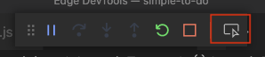
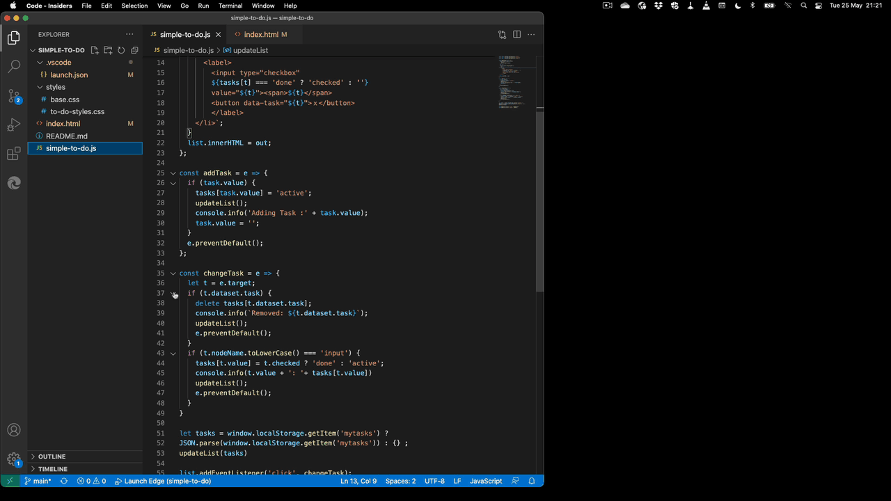

# Launching Edge DevTools from the JS Debugger workflow

Starting with Version 1.5.7 of Visual Studio Code, we integrated an option to start  Edge DevTools with the JavaScript debugging workflow.

When you choose the `run and debug` workflow and connect to Edge you get an additional `Open Browser DevTools` icon in the debugger toolbar that opens the DevTools panel in VS Code.



You can see this in action in the following screencast (activate to see full size):

[](img/EdgeDevTools-Breakpoint-Debugging-Integration.gif)

If you haven't got this extension installed yet, activating this icon will send you to the VS Code extensions tab and automatically search the extension to install for you.

In order to get this option, you need to select Edge as the debug type. In your `launch.json`  you need to select `pwa-msedge` as the `type`:

```javascript
{
    "version": "0.2.0",
    "configurations": [
        {
            "type": "pwa-msedge",
            "request": "launch",
            "name": "Launch Edge",
            "url": "http://localhost:8000",
            "webRoot": "${workspaceFolder}"
        }
    ]
}
```

Go [back to documentation](./index.md)
