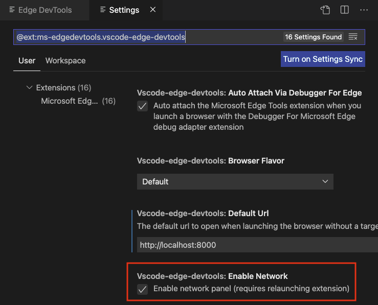

## Table of Contents

* [Supported Features](#supported-features)
* [Getting Started](#getting-started)
* [Using the tools](#using-the-tools)
  * [Launching the browser via the side bar view](#launching-the-browser-via-the-side-bar-view)
  * [Opening source files from the Elements tool](#opening-source-files-from-the-elements-tool)
  * [Getting Console information](#getting-console-information)
  * [Setting up your project to show live changes in the extension](#setting-up-your-project-to-show-live-changes-in-the-extension)
* [Changing Extension Settings](#changing-extension-settings)
  * [Turning on Network Inspection](#turning-on-network-inspection)
  * [Turning on Headless Mode](#turning-on-headless-mode)
* [Debug Configuration](#debug-configuration)
  * [Other optional launch config fields](#other-optional-launch-config-fields)
  * [Attaching automatically when launching the browser for debugging](#attaching-automatically-when-launching-the-browser-for-debugging)
* [Contributing](#contributing)
* [Other information](#other-information)
* [Data and Telemetry](#data-and-telemetry)
* [Reporting Security Issues](#reporting-security-issues)

## Supported Features

* Fully featured Elements and Network tool with views for HTML, CSS, accessibility and more.
* Screen-casting feature to allow you to see your page without leaving Visual Studio Code.
* Debug configurations for launching Microsoft Edge browser in remote-debugging mode and auto attaching the tools.
* Debug using a windowed or headless version of the Microsoft Edge Browser
* Side Bar view for listing all the debuggable targets, including tabs, extensions, service workers, etc.
* Go directly to the line/column for source files in your workspace when clicking on a link or CSS rule inside the Elements tool.
* Read console messages logged by the Developer Tools
* Auto attach the Microsoft Edge Tools when you start debugging with the in-built debugger.

## Getting Started

For use inside Visual Studio Code:

1. Install any channel (Canary/Dev/etc.) of [Microsoft Edge](https://aka.ms/edgeinsider).
1. Install the extension* [Microsoft Edge Tools](https://marketplace.visualstudio.com/items?itemName=ms-edgedevtools.vscode-edge-devtools).
1. Navigate to any project or open the folder containing the project you want to work on.

## Using the tools

### Launching the browser via the side bar view

* Start Microsoft Edge via the side bar
  * Click the `Microsoft Edge Tools` view in the side bar.
  * Click the `Open a new tab` icon to launch the browser (if it isn't open yet) and open a new tab.
* Attach the Microsoft Edge Tools via the side bar view
  * Click the `Attach` icon next to the tab to open the Microsoft Edge Tools.

The extension operates in two modes - it can launch an instance of Microsoft Edge navigated to your app, or it can attach to a running instance of Microsoft Edge. Both modes requires you to be serving your web application from local web server, which is started from either a Visual Studio Code task or from your command-line. Using the `url` parameter you tell Visual Studio Code which URL to either open or launch in the browser.

You can now use the high-fidelity tools to tweak your CSS and inspect network calls and go directly back to your code without leaving the editor.

### Opening source files from the Elements tool

One of the features of the Elements tool is that it can show you what file applied the styles and event handlers for a given node.

The source files for these applied styles and attached event handlers appear in the form of links to a url specified by the browser. Clicking on one will attempt to open that file inside the Visual Studio Code editor window.

### Setting up your project to show live changes in the extension

Out of the box the extension does not track live changes to the code you write. If you want the browser to automatically refresh when you changed a file, you need to set up a live reload environment. For this you need Node.js and npm on your machine. 

Say you have a folder with your production files on your hard drive called `my-project`. 

Preparation step: Install Node.js and the reload package

* Download and install [Node.js](https://www.nodejs.org) (you only need to do this once).
* Install the [reload NPM package](https://www.npmjs.com/package/reload?activeTab=readme)
  * Open command prompt and run `npm install reload -g` to install the package globally

Attach the extension to your live reloading project

* Navigate to your `my-project` folder in your command prompt and run `reload`
* Open VS Code and open the directory
* Go to the extension and launch an instance
* Navigate in the browser of the extension to `localhost:8080/{file name you want to open}`	
* All changes that are saved in this folder now trigger a refresh

## Changing Extension Settings

You can customize the extension to your needs. From version 1.1.6 onwards you can reach the Settings and read the Changelog via the `…` button of the sidebar.

### Turning off Network Inspection

If you don't want to see the Network Pane to inspect any network request of the attached browser you can turn it off in the settings and restart the extension.

