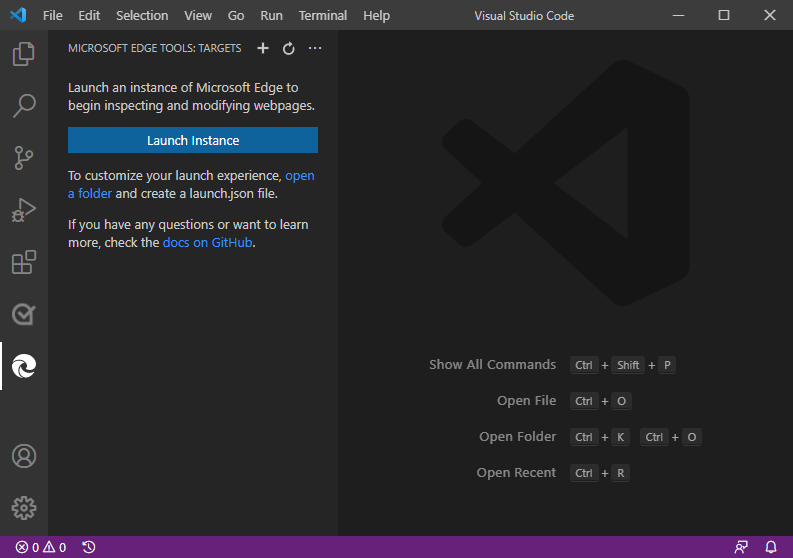
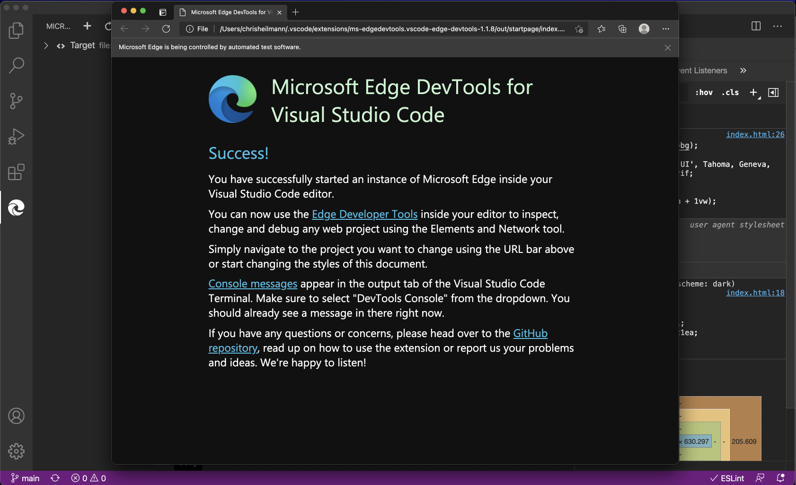
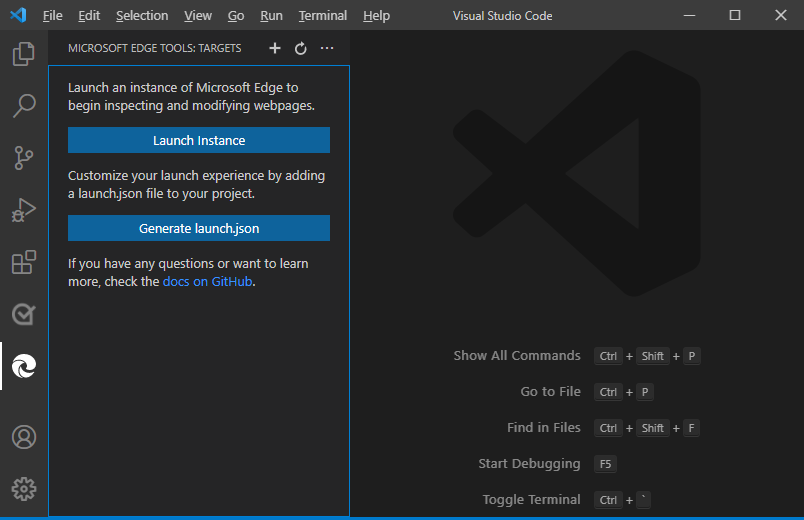
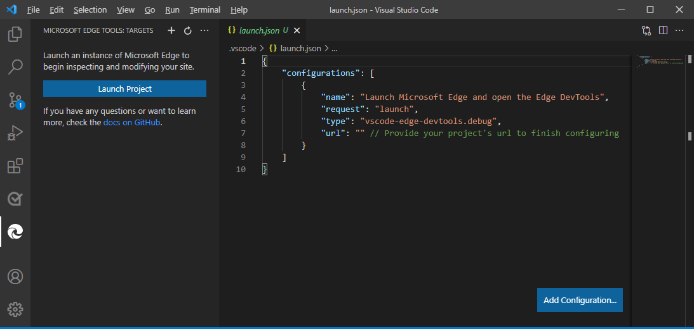

# Using the tools

This extension operates in several modes - it can launch an instance of Microsoft Edge navigated to your app, it can attach to a running instance of Microsoft Edge or it can open a new instance for you. All modes require you to be serving your web application from local web server, which is started from either a Visual Studio Code task or from your command-line. Using the `url` parameter you tell Visual Studio Code which URL to either open or launch in the browser.

## Opening a new browser instance

1. Select the **Microsoft Edge Tools** button in the **Activity Bar** on the left, .  In the **Side Bar**, the **MICROSOFT EDGE TOOLS: TARGETS** panel appears:

    

1. In the **Side Bar**, select the **Launch Instance** button.  Microsoft Edge opens, showing the new documentation page, which provides guidance and links for more information.  Also, in Visual Studio Code, DevTools opens.

    
1. In the URL bar, navigate to the project that you want to debug using Microsoft Edge Developer Tools for Visual Studio Code.

Alternatively, you can use the Edge Developer Tools in Visual Studio Code to launch Microsoft Edge with your own project, to debug it, as follows.

## Launching Microsoft Edge with your own project

1. In Visual Studio Code, open a new window (**File** > **New Window**).  At this point, no folder is opened.

1. In the **Activity Bar** on the left, select the **Microsoft Edge Tools** button.  In the **Side Bar**, the **MICROSOFT EDGE TOOLS: TARGETS** panel appears, showing a single button (**Launch Instance**):

    

1. In the **MICROSOFT EDGE TOOLS: TARGETS** panel, select the **open a folder** link, and open a folder, such as your own project.  The **MICROSOFT EDGE TOOLS: TARGETS** panel now shows two buttons: **Launch Instance** and **Generate launch.json**:

    

1. In the **Side Bar**, select the **Generate launch.json** button.  A `launch.json` file is generated in the root of the project, and is opened for editing.

    

1. In the `launch.json` file, change the URL from an empty string to a URL for your project.  Or leave the string empty, to show the new documentation page.

1. Save the `launch.json` file.

1. In the **Side Bar**, select the **Launch Project** button.  Microsoft Edge opens, showing the URL that you specified.  Also, in Visual Studio Code, DevTools opens.

Go [back to documentation](./index.md)
